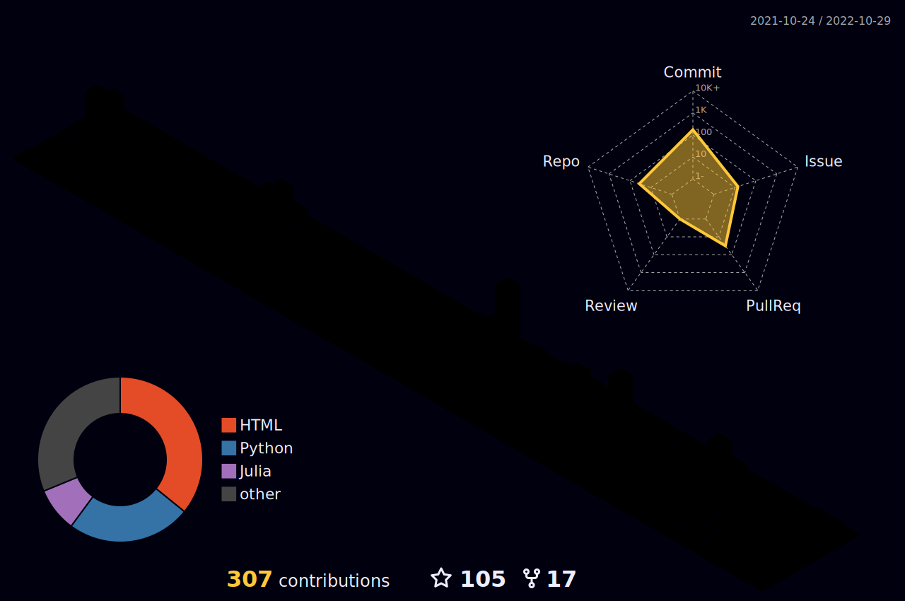

# Hey, I'm Saban Kara!

I focus on solutions, not problems, with an inquiring, questioning and productive mindset. I use my talents, skills and dreams to take my business to the next level. Machine learning is one of my biggest dreams, it gives me pleasure to work in this field, I try to discover my talents and improve my skills, I am happy to work with machine learning, I work with pleasure. While reading, I see that there are things I don't know, but that doesn't scare me!

Many service tools are used in **machine learning**; I'm working on **tensorflow** developed by **Google**, I'm on the way to specialize in **Natural Language Processing**

My current roadmap; 
 
Machine Learning Specialization --> https://www.coursera.org/specializations/machine-learning-introduction
    
             ✓ Supervised Machine Learning: Regression and Classification
             ✓ Advanced Learning Algorithms
             ○ Unsupervised Learning, Recommenders, Reinforcement Learning

TensorFlow Developer Professional Certificate --> https://www.coursera.org/professional-certificates/tensorflow-in-practice#courses

             ○ Introduction to TensorFlow for Artificial Intelligence, Machine Learning, and Deep Learning
             ○ Convolutional Neural Networks in TensorFlow
             ○ Natural Language Processing in TensorFlow
             ○ Sequences, Time Series and Prediction
    
Machine Learning Engineering for Production (MLOps) Specialization --> https://www.coursera.org/specializations/machine-learning-engineering-for-production-mlops#courses
    
             ○ Introduction to Machine Learning in Production
             ○ Machine Learning Data Lifecycle in Production
             ○ Machine Learning Modeling Pipelines in Production
             ○ Deploying Machine Learning Models in Production
    
 
Note: Mithrandir means Gandalf in Elvish. Gray Gandalf/Mithrandir disappeared in his deadly battle with Balrog and he came back as White.

 
 
    
    
 

 
  

